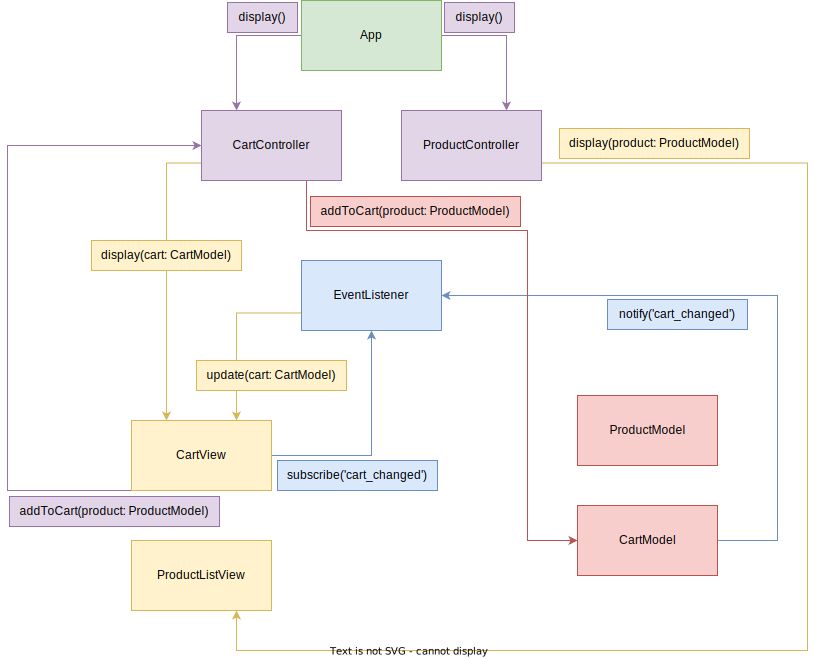

# PoC - MVC on the frontend

## Introduction

The main goal of this project is to illustrate the MVC pattern flow implemented in
a basic cart web application.

The picture below should give us an idea of the general
flow:



Note: we are not including the interactions with the services, which are called by the
models. They provide helpers and handlers which are used globally. We'll deep into it later.

## The main flow

Let's follow the picture above. The first step is to initialize the application using an `App`
instance, which creates the views, models, controllers and event handlers.

At the moment of "creation" of each resource, the constructors of each class run.
Let's see what happens at this point:

### Event handler

First of all, we create an `EventHandler` instance and make it available at `App` scope.
This class has two important methods:

- `subscribe(event: string, observer: Object)`: if an object is "interested" in some event
to happen, it should call this method. The first argument is the event key, which identifies
which type of event occurred. The second argument is the instance listening to the event
to happen.

> Note that the "observer" object doesn't need to be a view. It could be anything. Suppose
that you have some tracking service. You could subscribe it to the `cart_changed` event
and sync with this external service in the background.

How the view could handle this event? Well, it must follow something like an "interface" rule.
It must implement the `update(model: Object)` method, which receives the updated model, so
it can re-render what it needs with the updated data.

- `notify(eventType: string, model: Object)`: This method is used to notify that the `eventType`
event ocurred. In the second argument, the updated model is passed.
Internally, the event handler notifies all the observers subscribed to the `eventType` event,
by calling their `update(model: Object)` method. Note that the object passed to this method
should be the updated model, which will be used by the subscribers to handle the update.

So, for example, let's say we have a method to add an item to the cart:

```javascript
CartModel.prototype.addItem = function(product) {
  let item
  // do whatever mappings needed
  this.items.push(item)
}
```

When an item is added to the cart, the cart changes, so we should notify that this actually happened:

```javascript
CartModel.prototype.addItem = function(product) {
  let item
  // do whatever mappings needed
  this.items.push(item)
  this.eventHandler.notify('cart_changed', this)
}
```

Note that we pass `this` as second argument, since it's a reference to the instance that just changed.

### Models

Each entity within the application, is represented into a model. In this particular case, we have two
models: `CartModel` and `ProductModel`. The model implements the domain logic.

For example, the `CartModel`, should expose methods to add an item to the cart, remove an item from
the cart. If later we want to also edit an existing item or whatever, we add the logic in the
model and expose a method that just receives the item, and handles it.

The models are also responsible for notifying to the event handler that something changed.

### Views

The view is the UI (user interface) part. This is, the "interaction with the user" stack. All the
visual components that take input from the user, and display an output are represented by a view.

That being said, only the views should know how to talk with the browser and manipulate the DOM.

As mentioned earlier, the models notify that something changed through an event. The views which
show information about a model should be aware of the changes in the model, subscribing to
the events needed.

### Controllers

The controllers are the interface between the models and the views. They usually don't need much code
since most of the work is done by the model. The controller receives some input, does some validations
if needed and calls the model to do the actual work with the data it needs.

### App instance

This is the start point of the application. Initializes the models, the views, the controllers and
the event handlers.
After creating the resources, it calls the controllers, so they render the following views:

- CartView: Here we display all the items in the cart.
- ProductListView: Displays the list of products.

At this point, the views are created and, if needed, subscribed to some event(s). Controllers are also
initialized with the corresponding model and view.
